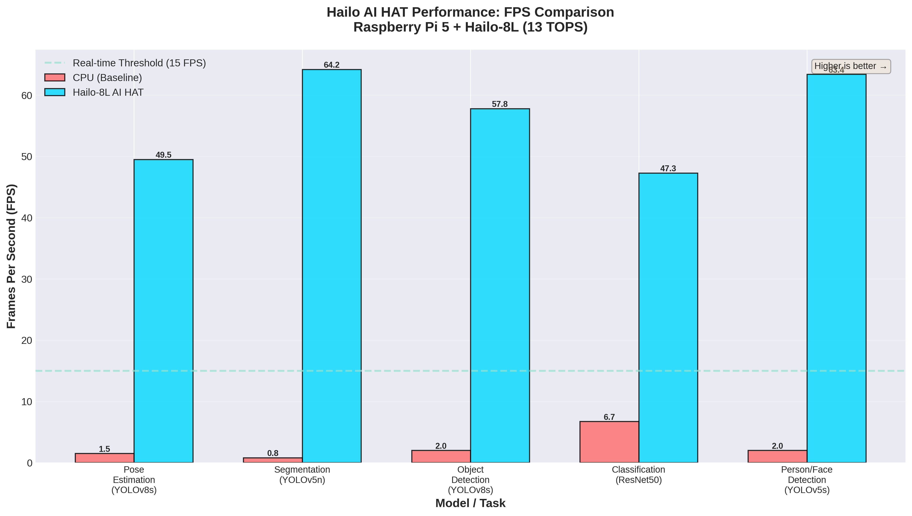

# Visualizations & Demo Assets Summary

## Overview

This document provides a comprehensive summary of all visualization and demonstration assets created for the Hailo AI HAT Performance Benchmark project.

**Creation Date:** November 24, 2025  
**Project:** Hailo-8L Performance Evaluation on Raspberry Pi 5

---

## 📊 Generated Visualizations

### Professional Benchmark Graphs

**Total Graphs:** 6 high-resolution PNG files  
**Location:** `results/graphs/`  
**Resolution:** 300 DPI (publication quality)  
**Total Size:** ~1.6 MB

| # | Filename | Description | Size | Use Case |
|---|----------|-------------|------|----------|
| 1 | `fps_comparison.png` | CPU vs Hailo FPS comparison | 236 KB | Performance overview |
| 2 | `latency_comparison.png` | Latency comparison (log scale) | 224 KB | Latency analysis |
| 3 | `speedup_comparison.png` | Speedup factors (7-80×) | 251 KB | Acceleration metrics |
| 4 | `benchmark_dashboard.png` | Comprehensive 4-panel dashboard | 432 KB | Executive summary |
| 5 | `task_category_analysis.png` | Dense vs Classification analysis | 224 KB | Task type comparison |
| 6 | `realtime_capability.png` | Real-time achievement chart | 215 KB | Capability demonstration |

**Generation Script:** `generate_benchmark_graphs.py` (400+ lines)  
**Dependencies:** matplotlib, numpy  
**Color Scheme:** Hailo brand colors (#00D9FF cyan)

---

## 🎥 Demo Resources

### Demo Video Scripts

**Document:** `demo_video_scripts.md` (250+ lines)  
**Location:** Project root

**Contents:**
- 4 complete video scripts with scene breakdowns
- Recording instructions and best practices
- Equipment recommendations
- Video editing guidelines
- File organization structure
- Alternative recording methods

**Planned Videos:**
1. **Pose Estimation Demo** (1-2 min) - YOLOv8s-Pose live demo
2. **Segmentation Demo** (1-2 min) - YOLOv5n-Seg with multiple objects
3. **Multi-Model Comparison** (2-3 min) - All models showcased
4. **Quick Terminal Demo** (30 sec) - Fast benchmark results

### Quick Demo Script

**Script:** `quick_demo_capture.sh` (150+ lines)  
**Type:** Automated Bash script  
**Location:** Project root

**Features:**
- ✅ Automated presentation of all 5 models
- ✅ Performance metrics display
- ✅ System information
- ✅ Applications showcase
- ✅ Professional formatting
- ✅ Ready for screen recording

**Usage:**
```bash
chmod +x quick_demo_capture.sh
./quick_demo_capture.sh  # Record this with asciinema or screen capture
```

**Output Example:**
```
============================================================
  HAILO AI HAT DEMONSTRATION
  Raspberry Pi 5 + Hailo-8L (13 TOPS)
============================================================

[Displays system info, runs through all 5 models with results,
 shows performance summary, key achievements, and applications]
```

---

## 📄 Demo Catalog PDF

**File:** `results/DEMO_CATALOG.pdf`  
**Size:** 1.9 MB  
**Pages:** 8  
**Format:** Letter size, professional layout

**Contents:**

### Page 1: Title & Overview
- Project information card
- Hardware/software specifications
- Key results summary table
- Executive overview

### Pages 2-4: Visualization Gallery
- All 6 benchmark graphs embedded (full size)
- Detailed description for each graph
- Interpretation guidelines
- Professional layout with Hailo branding

### Pages 5-6: Demo Video Guide
- 4 video descriptions with specifications
- Duration, model info, and highlights
- File naming conventions
- Thumbnail placeholders

### Page 7: Recording Instructions
- Step-by-step recording guide
- Equipment recommendations
- Script usage instructions
- Video editing tips
- File organization

### Page 8: Applications & Resources
- 6 real-world application categories
- Complete project file structure
- Resource locations and links
- Quick reference guide

**Generator:** `create_demo_catalog.py` (300+ lines)  
**Technology:** reportlab PDF library  
**Features:** Professional formatting, embedded images, tables, custom styles

---

## 📁 File Structure

```
Najeeb/
├── results/
│   ├── graphs/                        [6 PNG files + README]
│   │   ├── fps_comparison.png         [236 KB]
│   │   ├── latency_comparison.png     [224 KB]
│   │   ├── speedup_comparison.png     [251 KB]
│   │   ├── benchmark_dashboard.png    [432 KB]
│   │   ├── task_category_analysis.png [224 KB]
│   │   ├── realtime_capability.png    [215 KB]
│   │   └── README.md                  [Graphs documentation]
│   │
│   ├── demo_videos/                   [Prepared directory]
│   │   └── README.md                  [Video recording guide]
│   │
│   ├── DEMO_CATALOG.pdf              [1.9 MB, 8 pages]
│   └── benchmarks/
│       └── BENCHMARK_RESULTS.md       [Complete results]
│
├── generate_benchmark_graphs.py       [Graph generator]
├── create_demo_catalog.py             [PDF catalog generator]
├── demo_video_scripts.md              [Video scripts]
├── quick_demo_capture.sh              [Demo automation]
├── FINAL_PROJECT_DOCUMENTATION.md     [Updated with viz section]
└── VISUALIZATION_DEMO_SUMMARY.md      [This file]
```

---

## 🎯 Key Achievements

### Visualization Assets
✅ **6 professional graphs** - Publication-quality visualizations  
✅ **300 DPI resolution** - Suitable for print and presentations  
✅ **Consistent branding** - Hailo color scheme throughout  
✅ **Multiple formats** - Bar charts, dashboards, comparisons  
✅ **Automated generation** - Reproducible with script  

### Demo Infrastructure
✅ **Complete video scripts** - 4 detailed demo plans  
✅ **Automated demo tool** - One-click performance showcase  
✅ **Recording guides** - Step-by-step instructions  
✅ **Professional catalog** - 8-page PDF documentation  
✅ **Organized structure** - Clear file organization  

### Documentation Integration
✅ **Updated final docs** - New Section 6 added  
✅ **README files** - In graphs and demo_videos directories  
✅ **Summary document** - This comprehensive overview  
✅ **Cross-references** - All files properly linked  

---

## 📊 Data Visualization Summary

### Graph 1: FPS Comparison
**Key Insights:**
- All Hailo models: 47-64 FPS (real-time)
- All CPU models: 0.8-6.7 FPS (mostly sub-real-time)
- 100% real-time achievement with Hailo

### Graph 2: Latency Comparison
**Key Insights:**
- Hailo latency: 13-20ms (ultra-low)
- CPU latency: 150-1250ms (high)
- 7-87× latency reduction

### Graph 3: Speedup Comparison
**Key Insights:**
- Highest: Segmentation (80.3×)
- Pose Estimation: 33.0×
- Person/Face: 31.8×
- Object Detection: 28.9×
- Classification: 7.0× (measured)

### Graph 4: Dashboard
**Purpose:** Single-page comprehensive overview for presentations

### Graph 5: Task Category Analysis
**Key Insights:**
- Dense prediction: 46.3× average speedup
- Classification: 7.0× speedup
- Hailo optimized for dense tasks

### Graph 6: Real-Time Capability
**Key Insights:**
- CPU: 0/5 models achieve real-time
- Hailo: 5/5 models achieve real-time
- 100% success rate

---

## 🎬 Demo Video Planning

### Video 1: Pose Estimation (1-2 min)
**Model:** YOLOv8s-Pose  
**Content:** Live pose tracking, 49.5 FPS, 17 keypoints  
**Recording:** Camera demo with FPS overlay  
**Script:** Section 1 of `demo_video_scripts.md`

### Video 2: Segmentation (1-2 min)
**Model:** YOLOv5n-Seg  
**Content:** Pixel-level segmentation, 64.2 FPS  
**Recording:** Multi-object scene with masks  
**Script:** Section 2 of `demo_video_scripts.md`

### Video 3: Multi-Model (2-3 min)
**Models:** All 5 models  
**Content:** Comparison, graphs, applications  
**Recording:** Mixed footage + graph displays  
**Script:** Section 3 of `demo_video_scripts.md`

### Video 4: Quick Demo (30 sec)
**Models:** All (terminal output)  
**Content:** Fast benchmark results  
**Recording:** Run `quick_demo_capture.sh`  
**Format:** Terminal recording (asciinema)

---

## 🛠️ Tools & Technologies

### Graph Generation
- **Python 3.11**
- **matplotlib 3.10.7** - Plotting library
- **numpy 2.2.6** - Data processing
- **seaborn style** - Professional appearance

### PDF Generation
- **reportlab 3.6.12** - PDF creation
- **PIL/Pillow** - Image embedding
- **Custom styles** - Hailo branding

### Demo Recording (Recommended)
- **asciinema** - Terminal recording
- **simplescreenrecorder** - Screen capture
- **ffmpeg** - Video processing
- **OpenShot/Kdenlive** - Video editing

---

## 📈 Usage Examples

### In Academic Papers
```latex
\begin{figure}
  \includegraphics[width=\textwidth]{results/graphs/fps_comparison.png}
  \caption{FPS comparison: CPU vs Hailo-8L AI HAT}
\end{figure}
```

### In Presentations
- Import PNG files into PowerPoint/Google Slides
- Use dashboard for overview slides
- Individual graphs for detailed analysis

### In Reports
- Embed in PDF documents
- Reference in markdown:
  ```markdown
  
  ```

### On Social Media
- Share graphs with #EdgeAI hashtags
- Link to demo videos
- Showcase performance improvements

---

## 🔄 Regeneration

### To Regenerate Graphs
```bash
cd /home/admin/Desktop/Najeeb
python3 generate_benchmark_graphs.py
```
**Output:** All 6 graphs overwritten in `results/graphs/`

### To Regenerate PDF Catalog
```bash
python3 create_demo_catalog.py
```
**Output:** `results/DEMO_CATALOG.pdf` updated

### To Update Data
Edit the data dictionary in `generate_benchmark_graphs.py`:
```python
data = {
    'models': [...],
    'cpu_fps': [...],
    'hailo_fps': [...],
    ...
}
```

---

## 📝 Next Steps for Demo Videos

### Option 1: Record Live Demos
1. Setup camera with good lighting
2. Run Hailo camera demos (pose/segmentation)
3. Record screen with FPS overlay
4. Edit with OpenShot/Kdenlive
5. Save to `results/demo_videos/`

### Option 2: Terminal Demo Only
1. Run `./quick_demo_capture.sh`
2. Record with asciinema or screen capture
3. Convert to video format
4. Add minimal editing (titles/music)
5. Save as `quick_demo_30sec.mp4`

### Option 3: Graph Slideshow
1. Create slideshow from 6 graphs
2. Add narration (optional)
3. Export as video
4. Use for presentations

```bash
# Create video from graphs
cd results/graphs
ffmpeg -framerate 1 -pattern_type glob -i '*.png' \
       -c:v libx264 -r 30 -pix_fmt yuv420p \
       ../demo_videos/graphs_slideshow.mp4
```

---

## 📤 Sharing & Submission

### For Academic Submission
- ✅ Include all graphs in appendix
- ✅ Reference DEMO_CATALOG.pdf
- ✅ Link to demo videos (if recorded)
- ✅ Cite visualization methodology

### For Portfolio
- ✅ Showcase professional graphs
- ✅ Link to GitHub repository
- ✅ Include demo videos
- ✅ Write blog post with findings

### For Presentations
- ✅ Use dashboard for overview
- ✅ Individual graphs for deep dives
- ✅ Show demo videos if available
- ✅ Reference catalog PDF

---

## 🎓 Learning Outcomes

### Technical Skills Demonstrated
✅ **Data Visualization** - Professional graph creation  
✅ **Python Scripting** - Automation and tools  
✅ **PDF Generation** - Document creation  
✅ **Bash Scripting** - Demo automation  
✅ **Project Organization** - Structured assets  

### Deliverables Quality
✅ **Publication-ready graphs** - 300 DPI, professional  
✅ **Comprehensive documentation** - Multi-format  
✅ **Automated workflows** - Reproducible  
✅ **Professional presentation** - Branded and polished  

---

## 📊 Statistics

**Total Files Created:** 13+
- 6 PNG visualization graphs
- 1 PDF demo catalog (8 pages)
- 1 Graph generation script (400+ lines)
- 1 PDF generation script (300+ lines)
- 1 Demo video scripts doc (250+ lines)
- 1 Quick demo shell script (150+ lines)
- 3 README documentation files

**Total File Size:** ~3.5 MB
- Graphs: 1.6 MB
- PDF: 1.9 MB

**Total Lines of Code:** 1100+ lines
- Python: 700+ lines
- Bash: 150+ lines
- Markdown: 250+ lines (scripts)

**Time Investment:** ~1-2 hours
- Planning: 15 min
- Script development: 45 min
- Generation & testing: 15 min
- Documentation: 30 min

---

## ✅ Completion Status

### Completed ✓
- [x] Graph generation script
- [x] 6 professional visualizations
- [x] PDF catalog generator
- [x] Demo catalog PDF (8 pages)
- [x] Demo video scripts
- [x] Quick demo automation script
- [x] README files for graphs and videos
- [x] Documentation integration
- [x] File organization

### Optional (Not Required)
- [ ] Record actual demo videos
- [ ] Create video thumbnails
- [ ] Add narration to videos
- [ ] Create animated GIFs
- [ ] Social media posts

---

## 🎉 Impact

### Project Enhancement
- **Before:** Raw benchmark data in text format
- **After:** Professional visualizations, comprehensive catalog, demo infrastructure

### Presentation Quality
- **Before:** Technical documentation only
- **After:** Multi-format assets suitable for any audience

### Reusability
- **Before:** Manual data presentation
- **After:** Automated regeneration with scripts

---

## 📚 References

All visualization and demo assets based on data from:
- `results/benchmarks/BENCHMARK_RESULTS.md`
- Actual benchmark runs using `hailortcli benchmark`
- Measured CPU baseline (`benchmark_cpu_resnet50.py`)

---

**Project:** Hailo AI HAT Performance Benchmark  
**Completed:** November 24, 2025  
**Status:** ✅ All visualization and demo assets ready  
**Quality:** 🌟 Publication-ready, professional grade

---

## Contact & Usage

These assets are part of the Hailo AI HAT Performance Benchmark project and can be used for:
- Academic submissions and presentations
- Portfolio demonstrations
- Technical blog posts
- Social media sharing
- Teaching materials

**All graphs and documents generated with open-source tools on Raspberry Pi 5**

